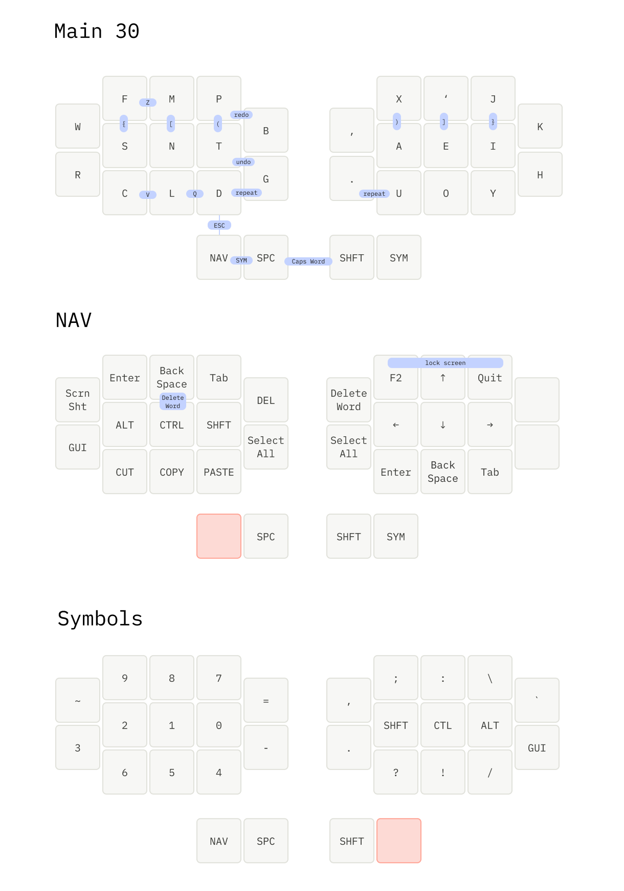

# zmk-config

## Layout

 

## Links

[jcmkk3](https://github.com/jcmkk3/zmk-config/tree/main)
[Mabroum](https://github.com/AlaaSaadAbdo/zmk-config/tree/master)

[1]: https://github.com/zmkfirmware/zmk
